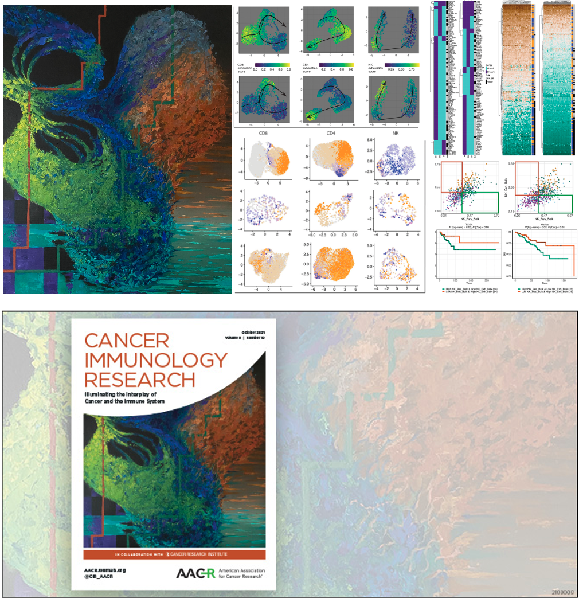

This repository contains R scripts, RMarkdown reports and small data dependencies associated with the manuscript [Foroutan M et al, The ratio of exhausted to resident infiltrating lymphocytes is prognostic for colorectal cancer patient outcome. *CIR*, 2021.](https://cancerimmunolres.aacrjournals.org/content/9/10/1125)

Available folders contain the below files:

- **data**: small data dependencies for each of the single cell and bulk data sets
- **output**: small data files obtained using the analysis pipelines
- **report**: several Rmarkdown (.Rmd) reports, containing teh main analyses codes. There are separate reports for each of the CD8, CD4, and NK cell, for training and testing the signatures in single-cell data sets, and for each of the TCGA and Marisa data. There are a few additional reports for comparing the signatures as well as for the survival analyses from independent datasets.
- **script**: some custom and collected functions used in this study. These scripts are sourced in the RMarkdown reports.

Please email momeneh.foroutan@monash.edu if you have any questions.

Overview of the study along with my acrylic painting inspired by this work, now on the [cover of Cancer Immunology Research](https://cancerimmunolres.aacrjournals.org/content/9/10.cover-expansion?sf153379191=1) journal (the October issue, 2021). 

